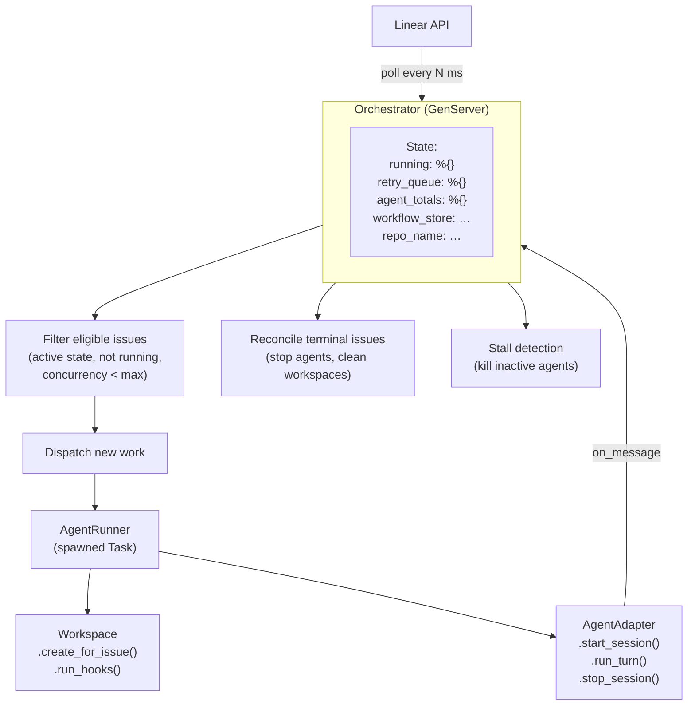
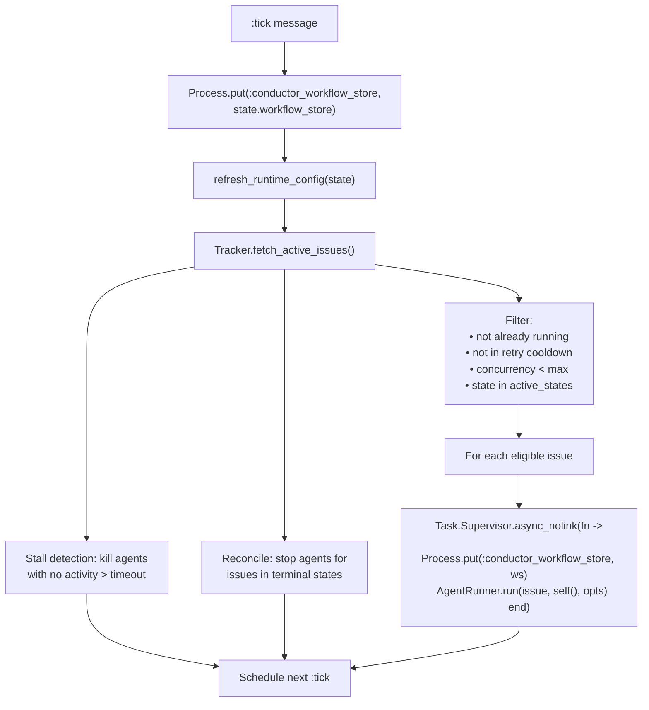
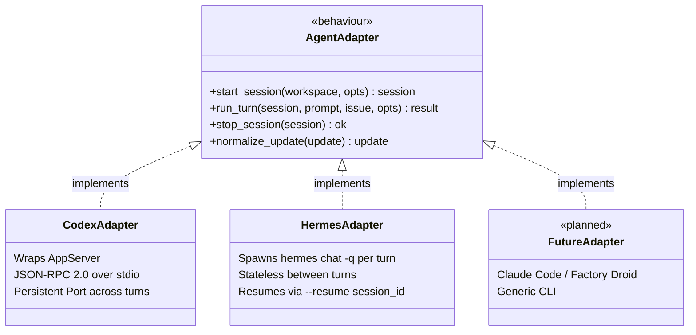
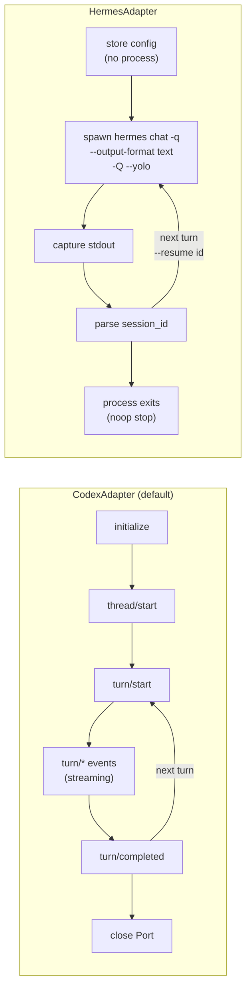
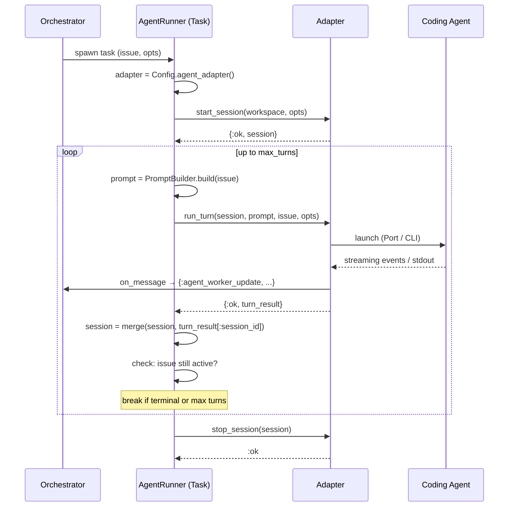
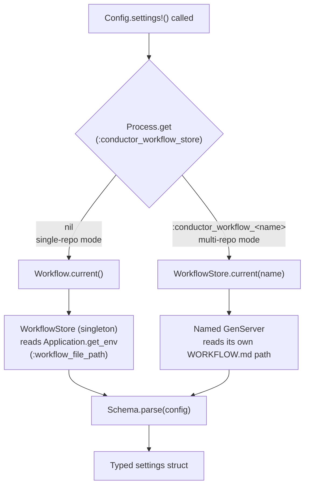

# Conductor Architecture

*Auto-maintained. Last updated: 2026-03-25 (Phase 3 complete)*

---

## System Overview

```mermaid
graph TB
    subgraph BEAM["CONDUCTOR (Single BEAM VM)"]
        subgraph AppSup["Application Supervisor (one_for_one)"]
            PubSub["Phoenix.PubSub"]
            TaskSup["Task.Supervisor<br/>(agent workers)"]
            HTTP["HTTP Server<br/>(Phoenix)"]
            Dashboard["Status Dashboard<br/>(LiveView)"]

            subgraph SingleRepo["Single-Repo Mode"]
                WS_S["WorkflowStore<br/>(singleton)"]
                Orch_S["Orchestrator<br/>(singleton)"]
            end

            subgraph MRS["MultiRepoSupervisor (DynamicSupervisor)"]
                subgraph Repo1["RepoSupervisor: api-service"]
                    WS1["WorkflowStore<br/>:conductor_workflow_api-service"]
                    Orch1["Orchestrator<br/>:conductor_orchestrator_api-service"]
                end
                subgraph Repo2["RepoSupervisor: frontend"]
                    WS2["WorkflowStore<br/>:conductor_workflow_frontend"]
                    Orch2["Orchestrator<br/>:conductor_orchestrator_frontend"]
                end
            end
        end

        subgraph Phoenix["Phoenix Endpoints"]
            EP1["GET / — LiveView Dashboard"]
            EP2["GET /api/v1/state — JSON"]
            EP3["(future) /mcp — MCP Server"]
        end
    end

    style SingleRepo fill:#2d5016,stroke:#4a8529
    style MRS fill:#1a3a5c,stroke:#2d6ca3
    style Repo1 fill:#1e3048,stroke:#2d6ca3
    style Repo2 fill:#1e3048,stroke:#2d6ca3
```



**Two modes:**
- **Single-repo mode** (backward compat): Singleton WorkflowStore + Orchestrator. Activated by: `symphony WORKFLOW.md`
- **Multi-repo mode**: MultiRepoSupervisor spawns per-repo process pairs. Activated by: `symphony --conductor-config conductor.yaml`

Both can coexist — the singleton handles one repo, MultiRepoSupervisor handles additional repos.

---

## Orchestration Flow



### Poll Cycle Detail



---

## Agent Adapter Layer



### Agent Protocol Comparison



### Agent Turn Lifecycle



---

## Config Resolution



### WORKFLOW.md Config Schema

```yaml
---
tracker:
  kind: linear
  project_slug: my-project
  active_states: [Todo, In Progress, Rework]
  terminal_states: [Done, Cancelled]

polling:
  interval_ms: 5000

workspace:
  root: ~/conductor-workspaces

agent:
  kind: codex              # codex | hermes
  max_concurrent_agents: 5
  max_turns: 20
  # Hermes-specific (ignored when kind: codex)
  hermes_provider: anthropic
  hermes_model: claude-sonnet-4
  hermes_skills: [commit, push, linear]
  hermes_toolsets: terminal,file,web

codex:                      # Codex-specific settings
  command: codex app-server
  approval_policy: never
  thread_sandbox: danger-full-access
  turn_sandbox_policy:
    type: dangerFullAccess
    networkAccess: true

hooks:
  after_create: |
    git clone --depth 1 {repo_url} .
---

{Jinja2 prompt template}
```

### conductor.yaml (Multi-Repo)

```yaml
repos:
  - name: api-service
    workflow: ./workflows/api-service.md
  - name: frontend
    workflow: ./workflows/frontend.md
  - name: infra
    workflow: ./workflows/infra.md
```

---

## File Structure

```
conductor/
├── NOTICE                          # Apache 2.0 attribution (OpenAI Symphony)
├── LICENSE                         # Apache 2.0
├── README.md                       # Conductor docs
├── SPEC.md                         # Symphony specification (upstream)
├── .hermes/
│   ├── plans/                      # (gitignored) local planning docs
│   └── skills/                     # Agent-agnostic Hermes skills
│       ├── commit/SKILL.md
│       ├── push/SKILL.md
│       ├── pull/SKILL.md
│       ├── land/SKILL.md
│       ├── linear/SKILL.md
│       └── review/SKILL.md
├── .codex/
│   └── skills/                     # Codex-specific skills (upstream)
├── docker/                         # Docker deployment (Phase 5)
├── elixir/
│   ├── mix.exs
│   ├── lib/
│   │   ├── symphony_elixir.ex                 # Application + supervision tree
│   │   └── symphony_elixir/
│   │       ├── agent_adapter.ex               # ★ Behaviour (Phase 1)
│   │       ├── agent_runner.ex                # ★ Refactored (Phase 1+2)
│   │       ├── agents/
│   │       │   ├── codex_adapter.ex           # ★ Codex wrapper (Phase 1)
│   │       │   ├── hermes_adapter.ex          # ★ Hermes CLI driver (Phase 2)
│   │       │   └── codex/
│   │       │       ├── app_server.ex          # Codex JSON-RPC (moved)
│   │       │       └── dynamic_tool.ex        # Codex tool injection (moved)
│   │       ├── conductor_config.ex            # ★ conductor.yaml parser (Phase 3)
│   │       ├── multi_repo_supervisor.ex       # ★ DynamicSupervisor (Phase 3)
│   │       ├── repo_supervisor.ex             # ★ Per-repo supervisor (Phase 3)
│   │       ├── config.ex                      # ★ Process-dict aware (Phase 1+3)
│   │       ├── config/schema.ex               # ★ agent.kind + hermes (Phase 2)
│   │       ├── orchestrator.ex                # ★ agent_* + multi-repo (Phase 1+3)
│   │       ├── workflow_store.ex              # ★ Named instances (Phase 3)
│   │       ├── cli.ex                         # ★ --conductor-config (Phase 3)
│   │       ├── status_dashboard.ex            # ★ Generic metrics (Phase 1)
│   │       ├── workspace.ex
│   │       ├── prompt_builder.ex
│   │       ├── tracker.ex
│   │       └── ...
│   ├── lib/symphony_elixir_web/
│   │   ├── presenter.ex                       # ★ agent_* fields (Phase 2)
│   │   └── live/dashboard_live.ex             # ★ agent_totals (Phase 2)
│   └── test/
│       └── symphony_elixir/
│           ├── hermes_adapter_test.exs        # ★ 17 tests (Phase 2)
│           └── ...
```

★ = Modified or created by Conductor (Phases 1–3)

---

## Future Architecture (Phase 4+)

```mermaid
graph TB
    subgraph Container["CONDUCTOR (Single Container)"]
        subgraph Elixir["Elixir BEAM"]
            Orchs["Orchestrator(s)"]
            WStores["WorkflowStore(s)"]
            Dash["Phoenix Dashboard"]
            API["Phoenix HTTP API<br/>/api/v1/state"]
        end

        subgraph Python["Python Sidecar (MCP Server)"]
            MCP["MCP Protocol Handler"]
            Tools["Tools:<br/>conductor_list_repos<br/>conductor_list_runs<br/>conductor_dispatch<br/>conductor_stop_run<br/>conductor_pause_repo<br/>conductor_set_agent"]
        end

        API -->|"JSON"| MCP
    end

    MCP -->|"MCP (stdio or HTTP)"| Client

    Client["MCP Client<br/>(Hermes, Claude Desktop, Cursor)"]

    style Elixir fill:#3b1261,stroke:#7b2fbf
    style Python fill:#14401d,stroke:#2d8a4e
```


